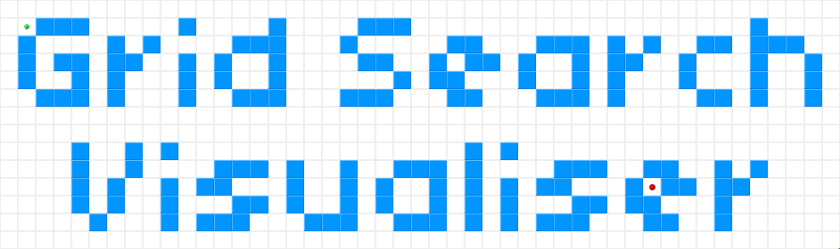
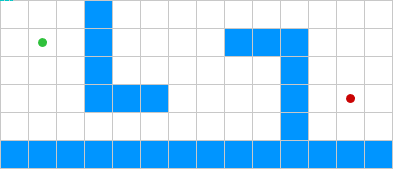

# A Online Algorithm Visualiser for Pathfinding Algorithms

The tool [Grid Search Visualiser](https://jps.mysticwind.de/) was created for my bachelor thesis "Jump Point Search on Directed Grids" at the University of Passau.

## Supported Grids

Two grid modes are supported:
 - Blockwise with optional diagonal and cross corner paths/ 
 - edgewise

## Supported Algorithms & Heuristics

| Algorithm                | Description |
| ------------------------ | - |
| **Dijkstra**             | The Dijkstra Pathfinding Algorithm. |
| **A\***                  | The A* Pathfinding Algorithm. |
| **DJPS The Directed**    | Jump Point Search Algorithm (alternative Version). |
| **DJPS Lookup**          | The Directed Jump Point Search Lookup Algorithm using pre-calculated lookup data. |
| **DJPS Pre-Calculation** | The Directed Jump Point Search Pre-Calculation Algorithm using backwards pre-calculation |

| Heuristics    | Description |
| ------------- | - |
| **Chebyshev** | The Chebyshev distance as heuristic. This distance is calculated by the moves a chess king would have to make. |
| **Euclidean** | The Euclidean distance as heuristic. This distance is calculated as the crow flies. |
| **Octile**    | The octile distance as heuristic. This distance is calculated by the length of the octile path. |
| **Manhattan** | The Manhattan distance as heuristic. This distance is calculated by summing the difference of the x and the y coordinates.  |
