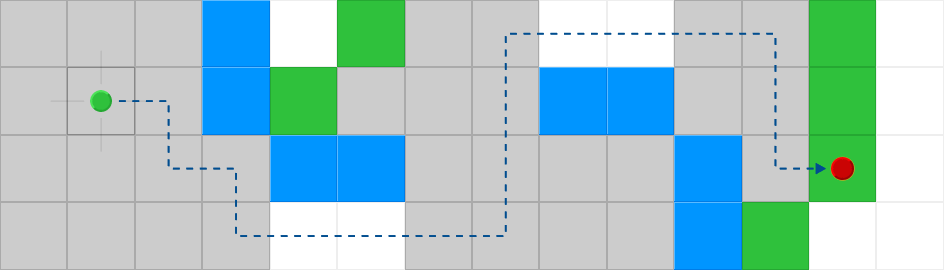

# Grid Search Visualiser
A online algorithm visualiser for pathfinding algorithms.

The tool was created for my bachelor thesis "Jump Point Search on Directed Grids" at the University of Passau.

## How to use
The tool can be used at [jps.mysticwind.de](https://jps.mysticwind.de/).

## Features

### 📈 Supported Grids
Two grid modes are supported with additional options:

| Grid Mode Blockwise | Grid Mode Edgewise |
| ------------------- | - |
|  |  |
| In this mode, each node can be blocked. | In this mode, each edge can be blocked per direction. |
|  |  |
| **+ option** crossing corners allowed. | Each blue object blocks a direction. |
|  | |
| **+ option** cardinal paths only. | |

### 🤖 Supported Algorithms
| Algorithm                | Description |
| ------------------------ | - |
| **Dijkstra**             | The Dijkstra Pathfinding Algorithm |
| **A\***                  | The A* Pathfinding Algorithm |
| **DJPS**                 | The Directed Jump Point Search Algorithm (alternative Version) |
| **DJPS Lookup**          | The Directed Jump Point Search Lookup Algorithm using pre-calculated lookup data |
| **DJPS Pre-Calculation** | The Directed Jump Point Search Pre-Calculation Algorithm using backwards pre-calculation |

### 📐 Supported Heuristics
| Heuristics    | Description |
| ------------- | - |
| **Chebyshev** | The Chebyshev distance as heuristic. This distance is calculated by the moves a chess king would have to make. |
| **Euclidean** | The Euclidean distance as heuristic. This distance is calculated as the crow flies. |
| **Octile**    | The octile distance as heuristic. This distance is calculated by the length of the octile path. |
| **Manhattan** | The Manhattan distance as heuristic. This distance is calculated by summing the difference of the x and the y coordinates.  |

## Built With
* [Dart](https://dart.dev/) - Programming language
* [Dart pub](https://pub.dev/) - Dependency Management
* [OverReact](https://github.com/Workiva/over_react) - React JS for Dart

## Authors
* **Kai Rädsch** - *Initial work* - [kairaedsch](https://github.com/kairaedsch)

## License
This project is licensed under the GNU General Public License - see the [LICENSE.md](LICENSE.md) file for details
